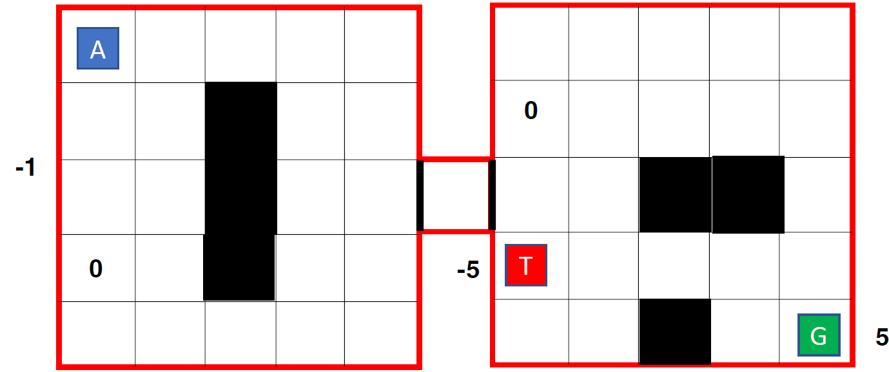
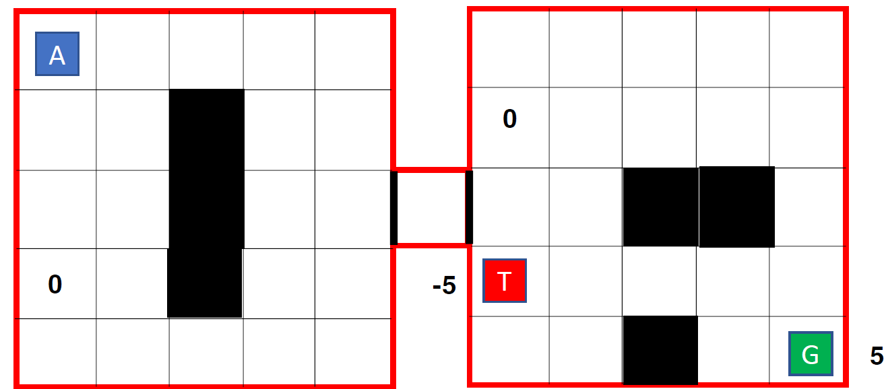

Here is your updated README.md, seamlessly integrating your detailed setup and running instructions with the existing content, and reflecting your actual script names (G24AIT071_AAI_Part1.py and G24AIT071_AAI_Part2.py). I’ve also updated the image references and clarified the script usage throughout.

---

# Q-Learning Reinforcement Learning: Grid World Tasks

This repository contains Q-learning implementations for solving custom grid world environments using Reinforcement Learning, with experiments focused on policy/value convergence and different hyperparameter settings.

## Overview

This project is divided into two main parts, each with its own environment and learning setup:

- **Part 1:** Standard 5x5 grid world (see below for details and image 1).
- **Part 2:** Two-room grid world environment (see below for details and image 2).

The environments and experiments are inspired by classical RL tasks. The agent learns optimal policies using Q-learning (ε-greedy and softmax action selection).

---

## Part 1: 5x5 Grid World



- **Environment:** 5x5 grid with walls (black cells), a start (A), a goal (G, +5 reward), and a terminal trap (T, -5 reward).
- **Actions:** North, South, East, West.
- **Rewards:**
  - Goal: **+5**
  - Trap: **-5**
  - Out of bounds: **-1**
  - All other states: **0**
- **Episodes:** 100,000
- **Random Seed:** Fixed for reproducibility

### Experiments

1. **Converged Policy and Value Function**
    - Plot the final policy (arrows per cell) and the value function for the grid, after learning.
2. **Discount Factor Variation**
    - Repeat above for γ = 0.1, 0.5, 0.9 (`epsilon=0.1`).
3. **Epsilon Sensitivity (for γ=0.9)**
    - Plot number of steps to reach the goal per episode for different ε: 0.1, 0.3, 0.5.

**Script for Part 1:**
- `G24AIT071_AAI_Part1.py` — Implements and runs all experiments for the standard 5x5 grid world.

---

## Part 2: Two-Room Grid World



- **Environment:** Two-room grid world (see above), with walls, narrow passage, start (A), goal (G, +5), trap (T, -5).
- **Actions:** North, South, East, West.
- **Rewards:** Same as Part 1.
- **Episodes:** 200,000
- **Random Seed:** Fixed for reproducibility

### Experiments

1. **Converged Policy and Value Function**
    - Plot the final policy and the value function, using **softmax action selection**.
2. **Discount Factor Variation**
    - Repeat for γ = 0.1, 0.5, 0.9 (`beta=0.1`).
3. **Beta Sensitivity (for γ=0.9)**
    - Plot number of steps to reach the goal per episode for different β: 0.1, 0.3, 0.5.

**Script for Part 2:**
- `G24AIT071_AAI_Part2.py` — Implements and runs all experiments for the advanced two-room grid world.

---

## Hyperparameters (for all experiments)

- **Learning Rate (α):** 0.1
- **Random Seed:** Fixed for all runs (for reproducibility)
- **Episodes:** As specified above

---

## SETUP INSTRUCTIONS

1. Open terminal/command prompt and navigate to the project folder.

2. Create a virtual environment:
   ```bash
   python -m venv venv
   ```

3. Activate the virtual environment:

   On Windows:
   ```bash
   venv\Scripts\activate
   ```

   On Mac/Linux:
   ```bash
   source venv/bin/activate
   ```

4. Install required packages:
   ```bash
   pip install -r requirements.txt
   ```

5. Verify installation:
   ```bash
   python -c "import numpy, matplotlib; print('Setup complete!')"
   ```

---

## RUNNING THE PROGRAMS

To run Part 1 (Basic GridWorld):
```bash
python G24AIT071_AAI_Part1.py
```

To run Part 2 (Advanced GridWorld):
```bash
python G24AIT071_AAI_Part2.py
```

---

## Outputs

- Policy and value function plots per experiment (saved as PNGs)
- Learning curves (steps-vs-episode)
- Example plots and learning curves are saved in the `results/` folder.
- See the notebook/script output for detailed convergence plots.

---

## References

- Sutton, R. S., & Barto, A. G. (2018). [Reinforcement Learning: An Introduction](http://incompleteideas.net/book/the-book.html).
- [OpenAI Gym](https://gym.openai.com/): RL environments inspiration.

---

## License

MIT License

---

## Author

- [Krishanpal Singh Rajput] (g24ait071@iitj.ac.in)

---

Let me know if you’d like any further formatting, sections, or clarifications!
